# Getting Used To The Interface.

## Main Window&#x20;

<figure>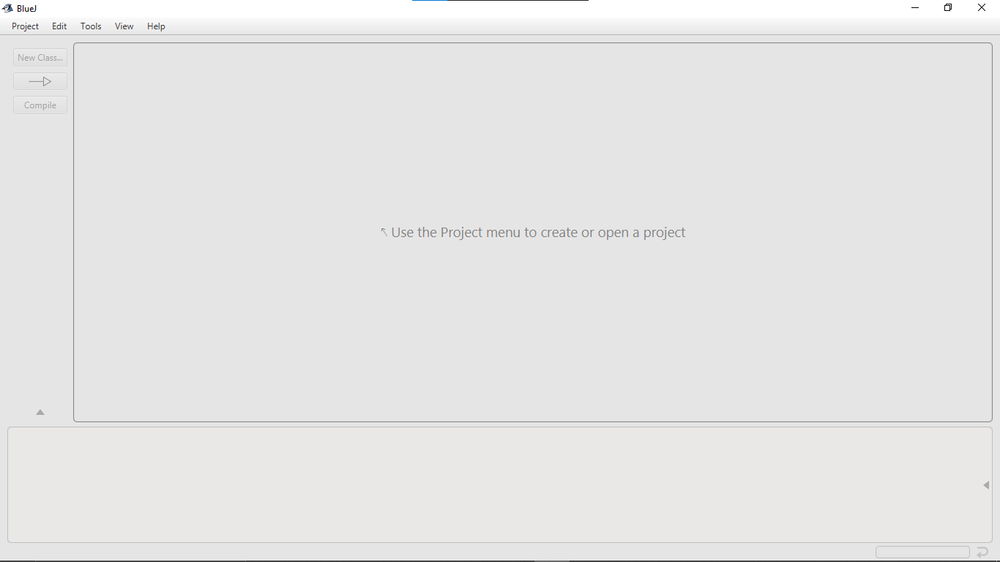<figcaption></figcaption></figure>

1.  Create new Project, lets say "Grade 10". &#x20;

    

    <figure>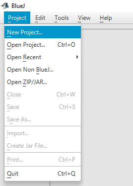<figcaption></figcaption></figure>

     

    <figure>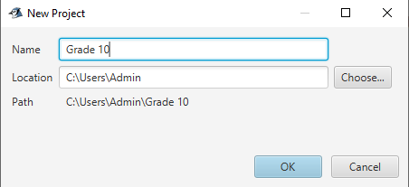<figcaption></figcaption></figure>

    

2.  A new window will open.&#x20;

    <figure>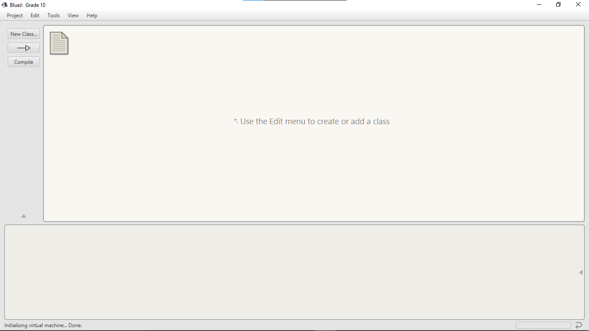<figcaption></figcaption></figure>
3.  Create a new Class.&#x20;

    <figure>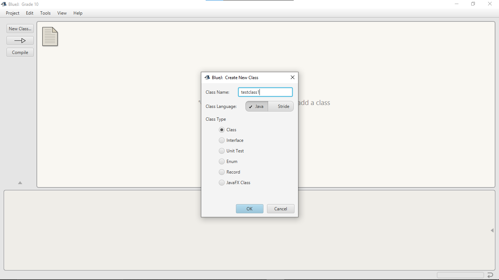<figcaption></figcaption></figure>
4.  Double click on it. A code editor will open.&#x20;

    <figure>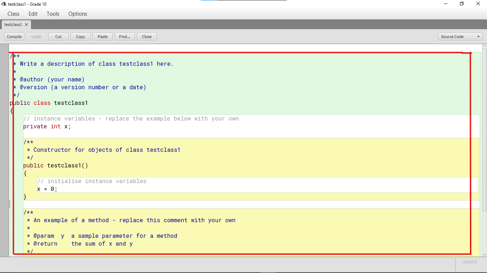<figcaption></figcaption></figure>
5.  You need to compile any code before being able to run it. To do this, Click on the compile button. It should show a message **`Class compiled - No Syntax Errors`** if there are no errors in the program.&#x20;

    <figure>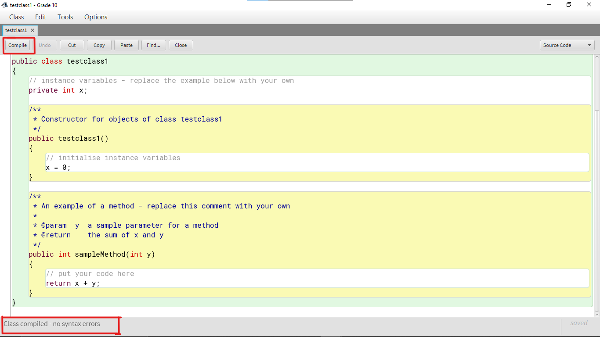<figcaption></figcaption></figure>
6.  Then, go to project window, where you made the class. right click the class. `new testclass1()`&#x20;

    <figure>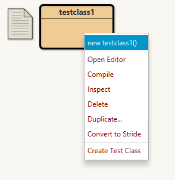<figcaption></figcaption></figure>
7.  Click on it, it will ask for a name, you can give a random one.&#x20;

    <figure>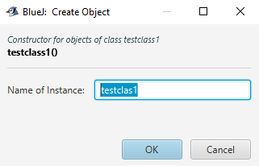<figcaption></figcaption></figure>
8.  A red box will appear at the bottom-left corner, with the name inputted. right click it and find the method from the program (You will learn more about methods later).&#x20;

    <figure>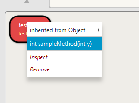<figcaption></figcaption></figure>
9.  If the method has an input variable, it will ask for one.&#x20;

    <figure>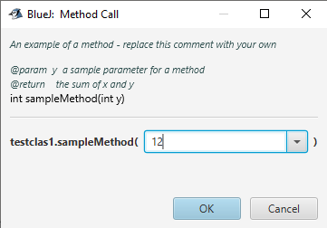<figcaption></figcaption></figure>
10. If the method has a console output, a new window will appear , printing the output.&#x20;

    <figure>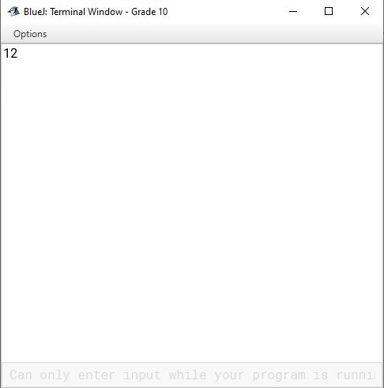<figcaption></figcaption></figure>

Next: Primitive data types in Java
