# Installation of BlueJ

## Steps:

1.  Go to [www.bluej.org](https://www.bluej.org/)&#x20;

    <figure>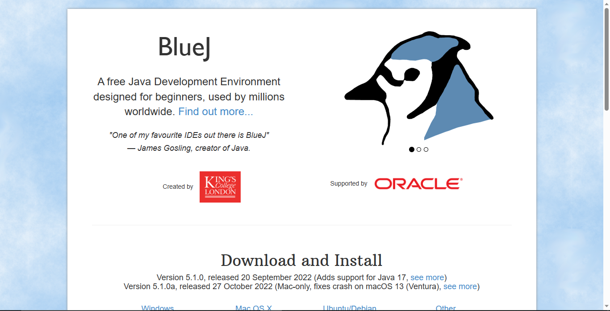<figcaption></figcaption></figure>
2.  Go to `Download and Install` tab.&#x20;

    <figure>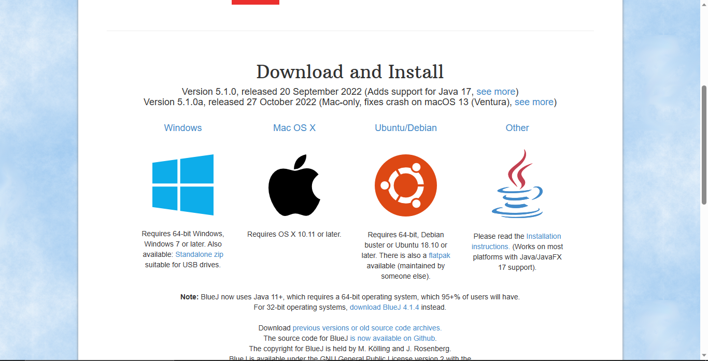<figcaption></figcaption></figure>
3.  Check your Operationg System. If you are not sure about your computer's processor, check [this link.](https://support.lenovo.com/in/en/solutions/ht117173-how-to-know-if-my-computer-is-32-bit-or-64-bit-windows)&#x20;

    <figure>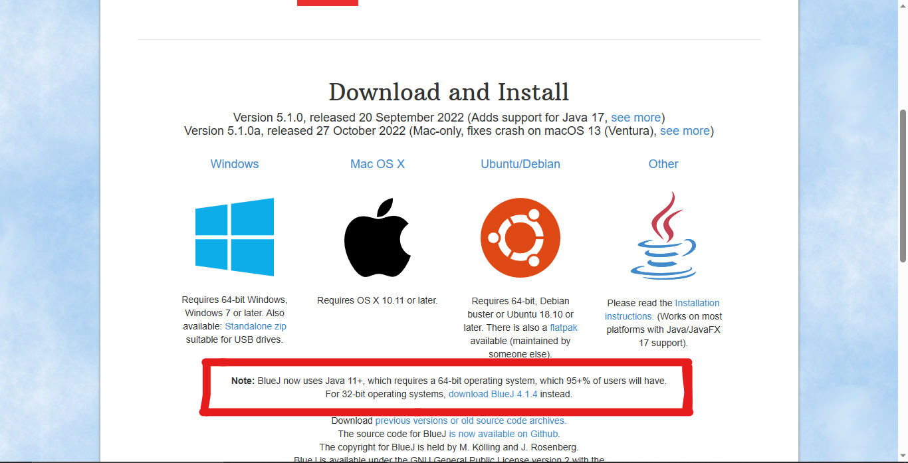<figcaption></figcaption></figure>
4.  Based On the operating system, click on the image.&#x20;

    <figure>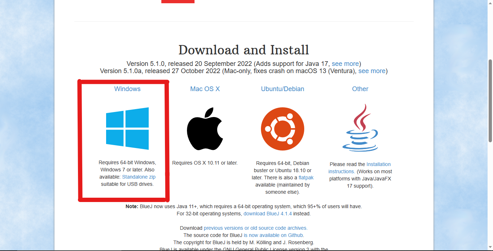<figcaption></figcaption></figure>
5.  Let it download.&#x20;

    <figure>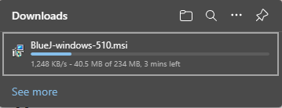<figcaption></figcaption></figure>
6.  Open the installer. &#x20;

    <figure>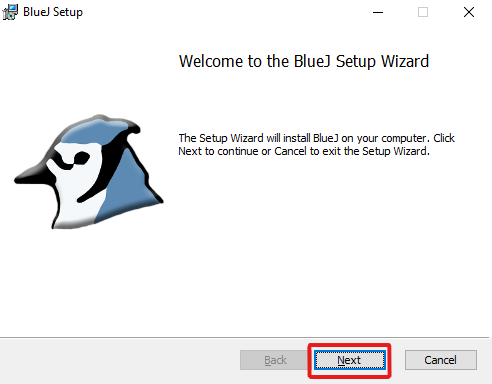<figcaption></figcaption></figure>
7.  Click on Next.&#x20;

    <figure>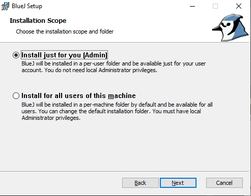<figcaption></figcaption></figure>
8.  &#x20;Click on Next.&#x20;

    <figure>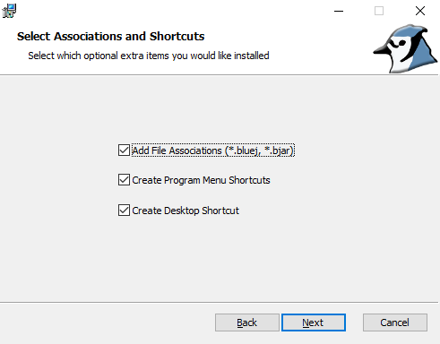<figcaption></figcaption></figure>
9.  &#x20;Click on Next.&#x20;

    <figure>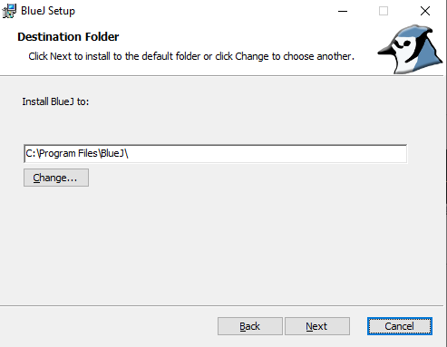<figcaption></figcaption></figure>
10. &#x20;Click on Next.&#x20;

    <figure>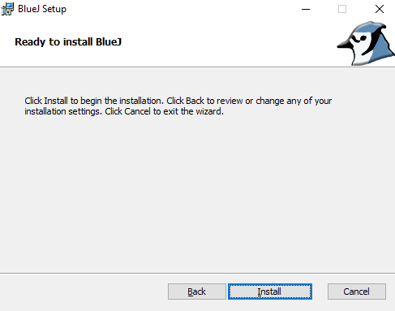<figcaption></figcaption></figure>
11. &#x20;Then click on Install. &#x20;

    <figure>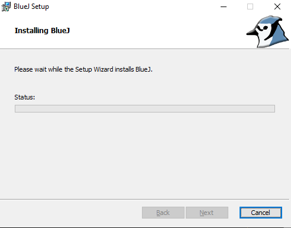<figcaption></figcaption></figure>
12. Then Wait for your _infernally slow_ pc to install it.&#x20;

    <figure>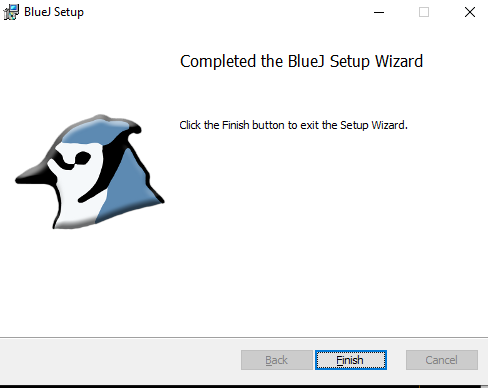<figcaption></figcaption></figure>
13. &#x20;Press Finish. Congrats! You installed BlueJ!
